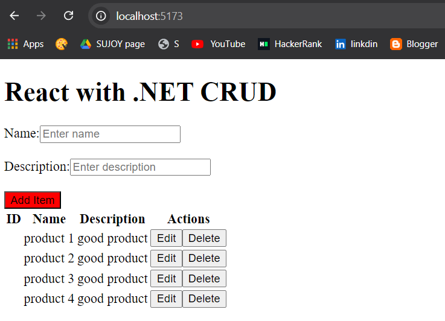

# ReactDotNetCRUD

 

A full-stack CRUD application built with React and .NET. This project demonstrates how to create a seamless interface using React for the frontend and .NET for the backend. It covers basic CRUD operations—Create, Read, Update, and Delete—allowing users to interact with a database through a web application.

## Key Features
- **Frontend:** Developed using React for a responsive and dynamic user interface.
- **Backend:** Powered by .NET for robust and scalable server-side operations.
- **Database:** Integration with a database for persistent data storage.
- **CRUD Operations:** Implemented full CRUD functionalities for managing data.
- **RESTful API:** Provides endpoints for client-server communication.

## Technologies Used
- React
- .NET (C#)
- SQL Server (or any other database you choose)
- Axios (for API calls)

## Application Screenshot


## Setup Instructions

### Frontend
1. Navigate to the frontend directory:
    ```bash
    cd frontend
    ```
2. Install dependencies:
    ```bash
    npm install
    ```
3. Run the frontend application:
    ```bash
    npm start
    ```

### Backend
1. Navigate to the backend directory:
    ```bash
    cd backend
    ```
2. Restore .NET dependencies:
    ```bash
    dotnet restore
    ```
3. Run the backend application:
    ```bash
    dotnet run
    ```

## Contributing
Feel free to open issues or submit pull requests if you have suggestions or improvements.

## License
This project is licensed under the MIT License.

## Contact
For any questions or feedback, please reach out to [Your Name](sujoyghoshal.s@gmail.com).

